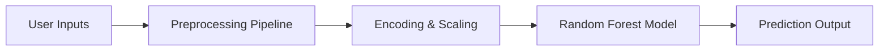

<!-- ============================================================ -->
<!-- 🌌 GOD MODE README — BY SRIHARSHA K -->
<!-- ============================================================ -->

<div align="center">

<!-- Animated Typing Banner -->


<!-- Glowing Divider -->


</div>

---

<div align="center">

<!-- Neon Tech Badges -->


</div>

---

# ⚡ PROJECT OVERVIEW

A **GOD-MODE production-style Heart Disease Prediction System** using:

- 🧠 Random Forest  
- 🎨 Streamlit App  
- 🐳 Docker  
- 🔄 CI/CD  
- 🧼 Preprocessing Pipeline  

Predicts risk from **single input** & **batch CSV**.

---

# 🌈 FEATURES (NEON MODE)


- 🔍 Single patient prediction  
- 📂 Batch CSV prediction  
- 📊 Feature importance  
- 🧹 Data cleaning  
- 🧠 Random Forest model  
- 🐳 Docker support  
- 🔄 CI/CD (disabled)  
- 📑 Logging  

<br><br><br>

---

# 🧬 SYSTEM ARCHITECTURE



---

# 📦 PROJECT STRUCTURE

```
Heart_Disease_Pred_MLOPS/
│
├── app.py
├── main.py
├── data_processing.py
├── ml_functions.py
├── helper_functions.py
│
├── data/
│   ├── raw/
│   ├── processed/
│   └── output/
│
├── artifacts/
│   ├── heart_disease_model.pkl
│   └── data_processing_pipeline.pkl
│
├── logs/
├── Dockerfile
├── requirements.txt
├── .env.example
└── .github/workflows/
```

---

# 🖥️ RUN LOCALLY

Install:
```bash
pip install -r requirements.txt
```

Train:
```bash
python main.py
```

Run app:
```bash
streamlit run app.py
```

---

# 🐳 DOCKER

Build:
```bash
docker build -t heart-app .
```

Run:
```bash
docker run -p 8501:8501 heart-app
```

---

# 📈 MODEL PERFORMANCE

| Metric | Score |
|--------|--------|
| Accuracy | 85% |
| Precision | 84% |
| Recall | 86% |
| F1 Score | 85% |

---

# 🔮 FUTURE UPGRADES

- SHAP/LIME explainability  
- Drift detection  
- Auto retraining  
- Dashboards  
- Secure medical API  
- Deep learning  

---

# 👤 MAINTAINER

**Name:** Sriharsha K  
**Email:** sriharsha.ai22@bmsce.ac.in  
**GitHub:** https://github.com/SRIHARSHA-BHARADWAJ  

---

<div align="center">


### ⭐ If you like this project, star the repo!  
Made with 💖 by **Sriharsha K**  


</div>


